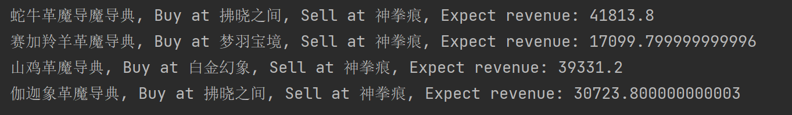

# FFXIV_Dealer

FF14卖货员，监测市场价格，提供倒货帮助！

# Funcnality

通过搜索不同服务器的物品价格，来分析买入卖出时机，以及不同服务器倒买倒卖的指南

# Screenshot 

当前效果

# TODO
- 提供价格预测分析模型，预测价格走向  
- 量化交易模型！是的！FF14量化交易！只要有市场就要有量化交易！
- 提供集合可视化面板！ 真正的交易员需要有可视化信息！
